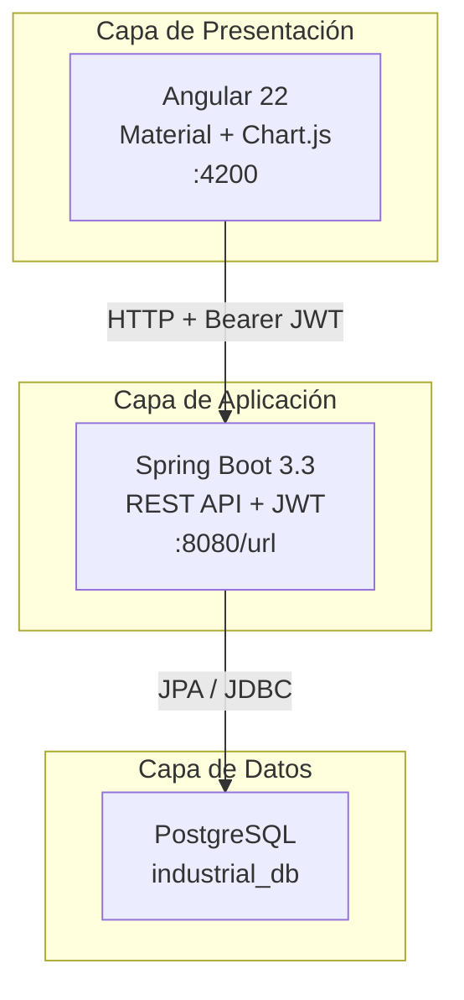
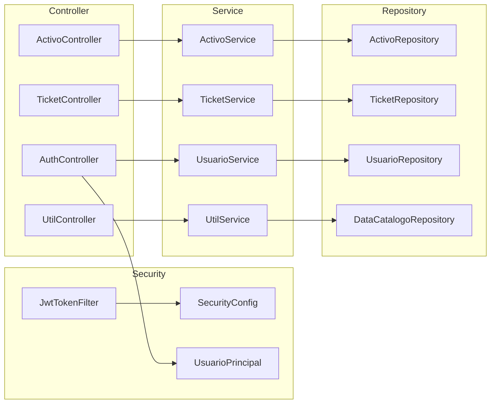
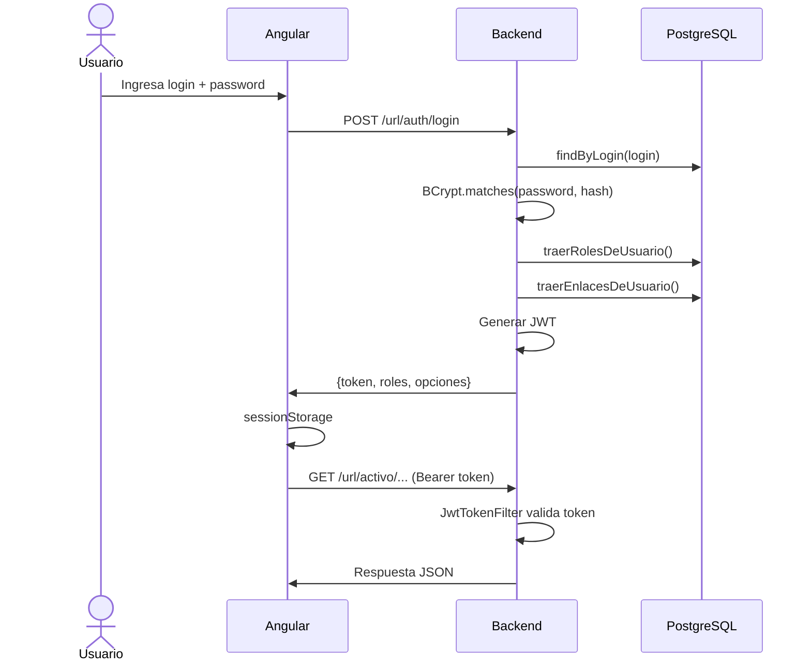
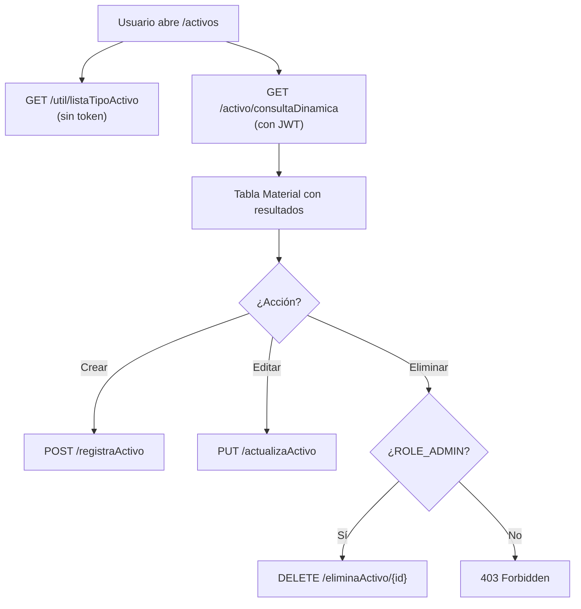

# Arquitectura — MaintPro Industrial OS

Documentación de requerimientos, planteamiento y diseño arquitectónico del sistema.

---

## 1. Planteamiento del problema

Las plantas industriales gestionan decenas o cientos de equipos críticos (compresores, bombas, motores, CNC). Sin un sistema centralizado:

- No hay visibilidad del inventario de maquinaria
- Las fallas se reportan por canales informales (WhatsApp, papel)
- No existen indicadores de disponibilidad ni urgencia
- Los permisos de acceso no están controlados

**MaintPro** centraliza el inventario de activos, el registro de tickets de mantenimiento y un panel de KPIs, con autenticación y roles.

---

## 2. Requerimientos

### Funcionales

| ID | Requerimiento | Módulo |
|----|---------------|--------|
| RF-01 | Autenticación de usuarios con JWT | Auth |
| RF-02 | Menú dinámico según rol del usuario | Auth / Seguridad |
| RF-03 | CRUD de activos (maquinaria industrial) | Activos |
| RF-04 | Consulta dinámica de activos con filtros opcionales | Activos |
| RF-05 | Registro de tickets de mantenimiento vinculados a un activo | Tickets |
| RF-06 | Consulta dinámica de tickets con filtros opcionales | Tickets |
| RF-07 | Catálogos auxiliares (tipos, prioridades, estados) | Util |
| RF-08 | Solo administradores pueden eliminar activos | Seguridad |
| RF-09 | Dashboard con KPIs de activos y tickets | Frontend |

### No funcionales

| ID | Requerimiento | Implementación |
|----|---------------|----------------|
| RNF-01 | API stateless (sin sesión en servidor) | JWT + Spring Security |
| RNF-02 | Base de datos relacional | PostgreSQL |
| RNF-03 | Esquema gestionado externamente | `ddl-auto=none` + scripts SQL |
| RNF-04 | CORS para frontend Angular | `SecurityConfig` → `:4200` |
| RNF-05 | Documentación de API | Swagger UI (`/swagger-ui.html`) |
| RNF-06 | Auditoría de registros | `fecha_registro`, `fecha_actualizacion`, `id_usuario_*` |

---

## 3. Arquitectura general



### Repositorios

| Componente | Repositorio | Tecnología |
|------------|-------------|------------|
| Frontend | [industrial-maint-frontend](https://github.com/PieroSalcedo/industrial-maint-frontend) | Angular 22 |
| Backend | [industrial-maint-backend](https://github.com/PieroSalcedo/industrial-maint-backend) | Spring Boot 3.3 |
| Base de datos | Scripts en `db/` del backend | PostgreSQL |

---

## 4. Arquitectura del backend (capas)



| Capa | Responsabilidad |
|------|-----------------|
| **Controller** | Exponer endpoints REST, validar entrada, mapear respuestas |
| **Security** | JWT, CORS, reglas de acceso por rol |
| **Service** | Lógica de negocio, transacciones |
| **Repository** | Acceso a datos con Spring Data JPA |
| **Entity** | Mapeo ORM a tablas PostgreSQL |

---

## 5. Flujo de autenticación



---

## 6. Flujo de gestión de activos



---

## 7. Patrón de catálogos

En lugar de crear una tabla por cada lista desplegable, se usa un **catálogo genérico**:

```
catalogo (1) ──< data_catalogo (N) ──< activo / ticket
```

Ventajas:
- Un solo repositorio y servicio para todos los combos
- Agregar un nuevo catálogo = 1 INSERT en `catalogo` + N INSERT en `data_catalogo`
- IDs estables referenciados desde `AppSettings.java`

Detalle completo en [MODELO-DATOS.md](./MODELO-DATOS.md).

---

## 8. Patrón de seguridad RBAC + menú dinámico

```
Usuario → Roles → Opciones de menú
         ↓
    Spring Security Authorities (ROLE_ADMIN, ROLE_TECH)
```

- **RBAC** (Role-Based Access Control): permisos por rol
- **Menú dinámico**: el backend devuelve las `opciones[]` en el login; Angular no hardcodea rutas
- **Doble capa**: backend valida con Spring Security; frontend oculta acciones no permitidas

---

## 9. Decisiones de diseño

| Decisión | Alternativa descartada | Motivo |
|----------|----------------------|--------|
| JWT stateless | Sesión HTTP | Escalabilidad, compatibilidad con SPA Angular |
| PostgreSQL | MySQL / H2 | Requerimiento del proyecto, robustez en producción |
| `ddl-auto=none` | `ddl-auto=update` | Control explícito del esquema vía scripts SQL versionados |
| Catálogo genérico | Tabla por combo | Menos duplicación, patrón estándar en ERP/industrial |
| Consulta dinámica con `-1` | Endpoints separados por filtro | Un solo endpoint flexible, usado por frontend y Swagger |
| Borrado físico de activos | Soft delete | Simplicidad; FK protege integridad con tickets |
| BCrypt para passwords | Texto plano / MD5 | Estándar de Spring Security |

---

## 10. Stack tecnológico completo

| Capa | Tecnología | Versión |
|------|------------|---------|
| Frontend | Angular | 22 |
| UI | Angular Material | 22 |
| Gráficos | Chart.js + ng2-charts | 4 / 10 |
| Backend | Spring Boot | 3.3.2 |
| Lenguaje backend | Java | 21 |
| ORM | Spring Data JPA / Hibernate | 6.x |
| Seguridad | Spring Security + JWT | jjwt 0.11.5 |
| API Docs | springdoc-openapi | 2.6.0 |
| Base de datos | PostgreSQL | 14+ |
| Build backend | Maven | 3.9+ |
| Build frontend | npm / Angular CLI | 22 |

---

## 11. Despliegue local

```text
1. PostgreSQL activo
2. Ejecutar db/00_create_database.sql → schema.sql → seed.sql
3. Configurar .env en backend (copiar de .env.example)
4. mvn spring-boot:run                          → :8080
5. npm start en frontend                         → :4200
6. Login: admin / admin2026
```

---

## 12. Extensiones futuras (fuera de alcance actual)

- Migraciones versionadas con Flyway o Liquibase
- Endpoint dedicado de reportes/KPIs en backend
- CRUD de tickets (actualización de estado)
- Soft delete en activos
- Notificaciones por correo en tickets críticos
- Docker Compose para levantar todo el stack

---

## Referencias

- [Modelo de datos](./MODELO-DATOS.md)
- [Scripts SQL](../db/README.md)
- [README principal](../README.md)
- [Frontend](https://github.com/PieroSalcedo/industrial-maint-frontend)
