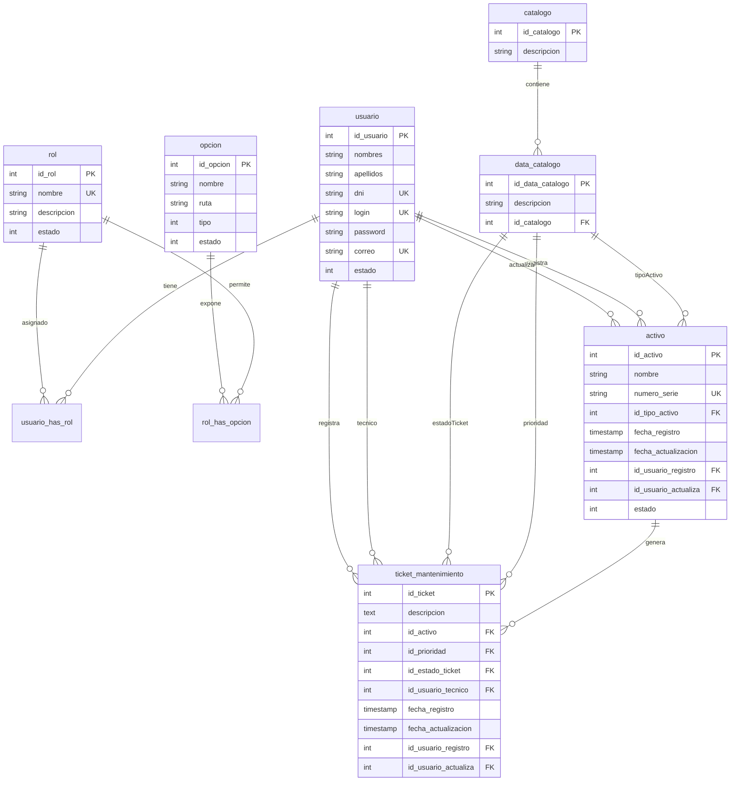
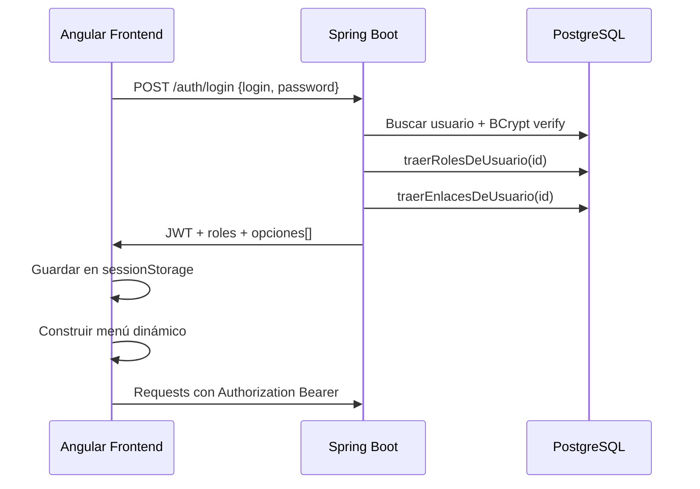

# Modelo de datos — MaintPro Industrial OS

Documentación del diseño de base de datos PostgreSQL para el sistema de gestión de mantenimiento industrial.

---

## Diagrama entidad-relación



---

## Módulos del modelo

El esquema se organiza en tres bloques:

| Bloque | Tablas | Propósito |
|--------|--------|-----------|
| **Seguridad** | `usuario`, `rol`, `opcion`, `usuario_has_rol`, `rol_has_opcion` | Autenticación, autorización y menú dinámico |
| **Catálogos** | `catalogo`, `data_catalogo` | Valores maestros reutilizables |
| **Negocio** | `activo`, `ticket_mantenimiento` | Inventario de maquinaria e incidencias |

---

## Catálogo y DataCatalogo

Patrón **maestro-detalle** para evitar tablas duplicadas por cada tipo de lista desplegable.

### Concepto

```
catalogo (grupo)          data_catalogo (valores)
─────────────────         ──────────────────────────
1 → Tipo de Activo   →    Compresor, Bomba, Motor...
2 → Prioridad        →    Baja, Media, Alta, Crítica
3 → Estado Ticket    →    Pendiente, En Proceso, Resuelto...
```

### ¿Por qué dos tablas?

| Sin catálogo | Con catálogo |
|--------------|--------------|
| Tabla `tipo_activo`, tabla `prioridad`, tabla `estado_ticket`... | Una sola estructura reutilizable |
| Duplicación de lógica en backend y frontend | Un endpoint genérico `/util/listaX` por ID de catálogo |
| Difícil agregar nuevos catálogos | Solo insertar fila en `catalogo` + valores en `data_catalogo` |

### IDs fijos (backend)

En `AppSettings.java`:

```java
public static final int CATALOGO_TIPO_ACTIVO = 1;
public static final int CATALOGO_PRIORIDAD = 2;
public static final int CATALOGO_ESTADO_TICKET = 3;
```

El endpoint `/url/util/listaTipoActivo` consulta `data_catalogo WHERE id_catalogo = 1`.

### Uso en entidades de negocio

| Entidad | Campo | Referencia |
|---------|-------|------------|
| `Activo` | `id_tipo_activo` | `data_catalogo` del catálogo 1 |
| `TicketMantenimiento` | `id_prioridad` | `data_catalogo` del catálogo 2 |
| `TicketMantenimiento` | `id_estado_ticket` | `data_catalogo` del catálogo 3 |

---

## Roles, opciones y menú dinámico

### Tablas de seguridad

```
usuario ──< usuario_has_rol >── rol ──< rol_has_opcion >── opcion
```

- **`usuario`**: credenciales y datos personales. Password en BCrypt.
- **`rol`**: perfil de acceso. El campo `nombre` usa formato `ROLE_ADMIN` (requerido por Spring Security).
- **`opcion`**: ítem de menú del frontend (nombre, ruta Angular, tipo).
- **`usuario_has_rol`**: qué roles tiene cada usuario (N:N).
- **`rol_has_opcion`**: qué módulos del menú ve cada rol (N:N).

### Campo `tipo` en opcion

El frontend Angular agrupa el menú según el campo `tipo`:

| tipo | Menú en Angular | Ejemplo |
|------|-----------------|---------|
| 1, 3 | **GESTIÓN** | Activos, Tickets |
| 2, 4 | **REPORTES** | Dashboard KPIs |

Ver `menu.ts`: `opcMantenimiento` filtra `tipo === 1 || tipo === 3`.

### Flujo al iniciar sesión



### Permisos por rol

| Acción | ROLE_ADMIN | ROLE_TECH |
|--------|------------|--------------|
| Ver activos y tickets | Sí | Sí |
| Crear / editar activos | Sí | Sí |
| **Eliminar activos** | **Sí** | **No** (403 en backend) |
| Registrar tickets | Sí | Sí |
| Ver dashboard | Sí | Sí |

La restricción de eliminación está en `SecurityConfig.java`:

```java
.requestMatchers(HttpMethod.DELETE, "/url/activo/**").hasAuthority("ROLE_ADMIN")
```

El frontend oculta el botón eliminar si el JWT no incluye `ROLE_ADMIN`.

---

## Activo

Representa un equipo o maquinaria industrial bajo control de mantenimiento.

| Campo | Descripción |
|-------|-------------|
| `nombre` | Nombre descriptivo del equipo |
| `numero_serie` | Identificador único de fábrica |
| `id_tipo_activo` | FK a `data_catalogo` (catálogo 1) |
| `estado` | `1` = operativo (disponible), `0` = fuera de servicio (parado por falla/mantenimiento) |
| `fecha_registro` / `fecha_actualizacion` | Auditoría automática (`@PrePersist`, `@PreUpdate`) |
| `id_usuario_registro` / `id_usuario_actualiza` | Usuario que creó/modificó |

### Reglas de negocio

- No se puede eliminar un activo si tiene tickets vinculados (restricción FK en PostgreSQL).
- Al registrar un ticket, el activo pasa automáticamente a **fuera de servicio** (`estado = 0`).
- Al cerrar o eliminar tickets, el activo vuelve a **operativo** (`estado = 1`) solo si no quedan tickets en estado Abierto o En Reparación.

---

## Ticket de mantenimiento

Orden de trabajo por falla o mantenimiento preventivo.

| Campo | Descripción |
|-------|-------------|
| `descripcion` | Detalle de la incidencia |
| `id_activo` | Equipo afectado |
| `id_prioridad` | FK a `data_catalogo` (catálogo 2) |
| `id_estado_ticket` | FK a `data_catalogo` (catálogo 3) |
| `id_usuario_tecnico` | Técnico asignado |
| Campos de auditoría | Igual que `activo` |

---

## Consultas dinámicas

Tanto activos como tickets usan el patrón **`-1` = filtro omitido**:

```sql
-- Ejemplo conceptual (activo)
WHERE (?3 = -1 OR id_tipo_activo = ?3)
  AND (?4 = -1 OR estado = ?4)
```

El frontend envía `-1` cuando el usuario no selecciona un filtro en el combo.

---

## Scripts SQL

Los archivos están en la carpeta [`db/`](../db/):

| Archivo | Contenido |
|---------|-----------|
| `schema.sql` | DDL unificado (incluye `rol.descripcion` y `rol.estado`) |
| `seed.sql` | Datos demo: catálogos, usuarios, roles, menú, activos y tickets |

---

## Convenciones de nomenclatura

| Elemento | Convención | Ejemplo |
|----------|------------|---------|
| Tablas | snake_case, singular | `ticket_mantenimiento` |
| PK | `id_<tabla>` | `id_activo` |
| FK | `id_<referencia>` | `id_tipo_activo` |
| Tablas N:N | `<entidad1>_has_<entidad2>` | `usuario_has_rol` |
| Roles Spring | Prefijo `ROLE_` | `ROLE_ADMIN` |
